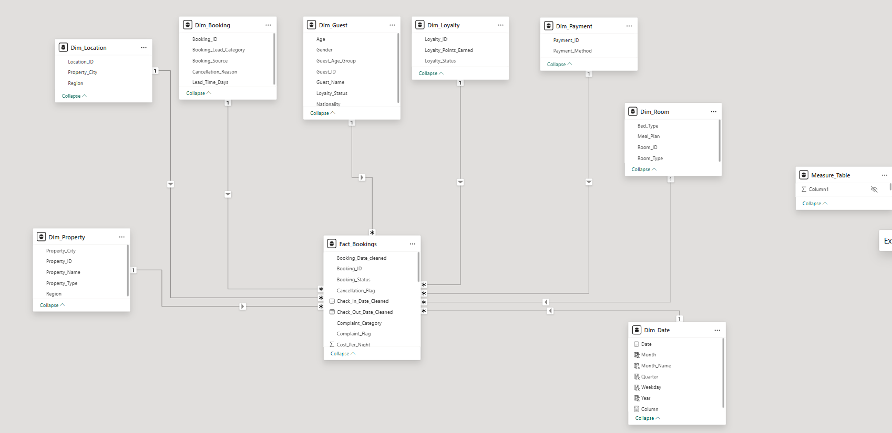
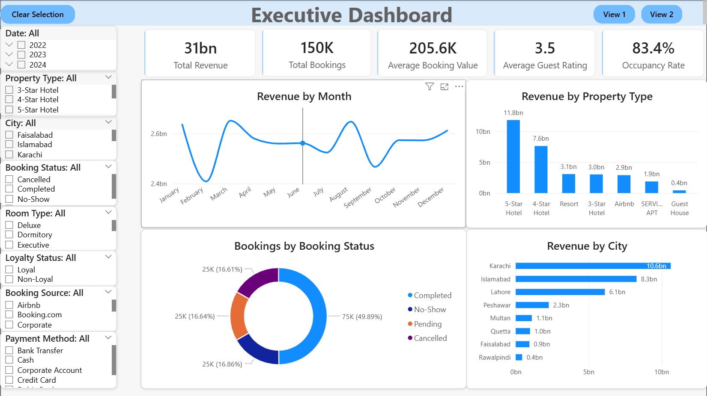
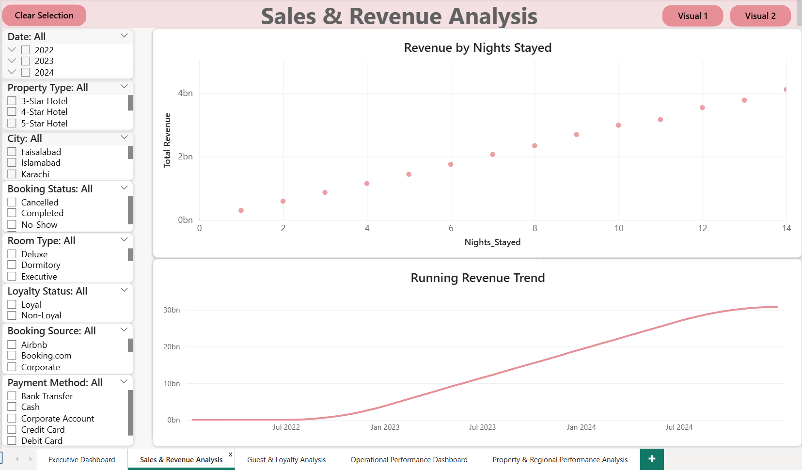
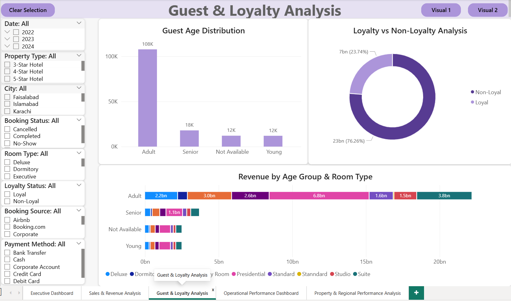
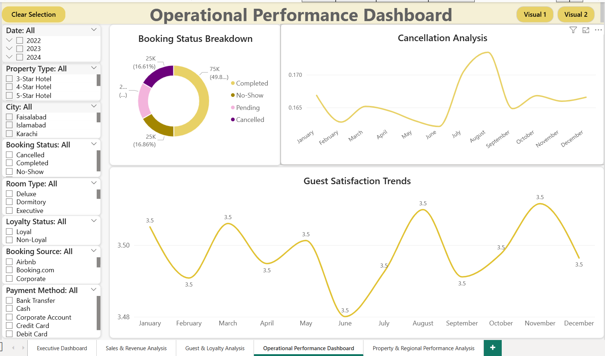
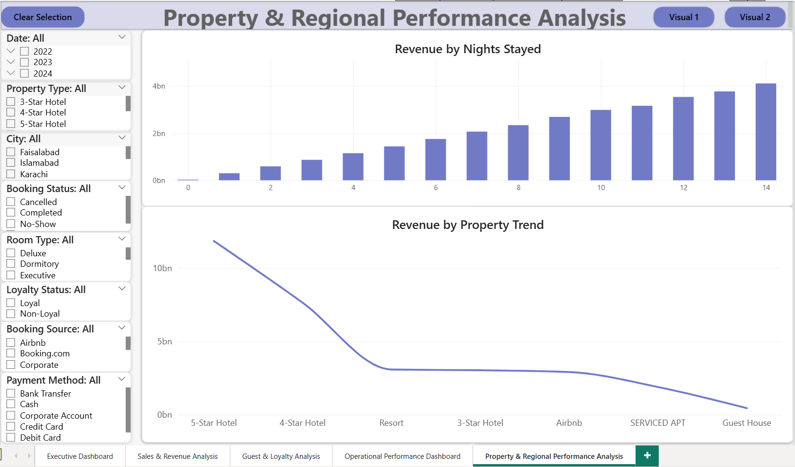

# Hotel-Airbnb-Booking-Analytics-System
This Power BI portfolio project features a Hotel &amp; Airbnb Booking Analytics System. It transforms raw data into insights using ETL, star schema modeling, and DAX. The interactive dashboard tracks revenue, occupancy, and guest behaviour to optimize business decisions.

## 📌 Business Problem & Objective
A rapidly growing hospitality company managing hotels and Airbnb-style rentals across multiple cities faced challenges in tracking business performance. Relying on manual spreadsheet reports made it difficult to monitor revenue growth, occupancy fluctuations, and service quality.

This project delivers a centralized Business Intelligence solution using Microsoft Power BI to replace manual reporting. The system provides interactive, real-time insights into revenue, profitability, guest behavior, and operational efficiency.

## 📊 Dataset
Source Data: HotelAirbnb_PortfolioProject.csv

Volume: Approximately 150,000 hotel and Airbnb booking records.

Scope: Includes booking details, property info, revenue/pricing, guest demographics, and operational metrics like complaints and ratings.

## 🛠️ Data Sourcing & Transformation (ETL)
Data extraction, cleaning, and transformation were performed using Power Query to ensure high data quality and accuracy.

Standardization: Corrected data types and standardized date formats across the dataset.

Deduplication: Identified and removed duplicate Booking_ID records.

Handling Missing Values: Replaced null values in text fields (Meal Plan, Reviews, Complaints, Cancellations) with meaningful labels.

Feature Engineering: Created new categorical columns including Guest_Age_Group, Loyalty_Status, Booking_Lead_Category, Revenue_Category, Occupancy_Status, and Stay_Duration_Category.

Validation: Validated revenue calculations and strictly excluded cancelled bookings from occupancy rate calculations.

## 🗄️ Data Model
The data model was structured using a highly optimized Star Schema.

Fact Table: Fact_Bookings (Contains transaction details and measurable values).

Dimension Tables: Dim_Date, Dim_Guest, Dim_Property, Dim_Room, Dim_Payment, Dim_Location, Dim_Booking, Dim_Loyalty.

Measures: A dedicated _Measures table was created to house all DAX calculations cleanly.

## 📈 Dashboard Pages & Insights
The solution consists of a 5-page interactive dashboard. 

### 1. Executive Overview
Features high-level KPI cards, revenue trends, and booking status breakdowns to monitor overall business health.

### 2. Sales & Revenue Analysis
Evaluates profit margins and revenue drivers by property and room type, along with running revenue trends.

### 3. Guest & Loyalty Analysis
Analyzes customer behavior, repeat guest rates, rating distributions, and the revenue impact of loyalty programs.

### 4. Operational Dashboard
Monitors service quality by tracking cancellation reasons, complaint categories, and satisfaction trends.

### 5. Property & Regional Performance
Highlights top-performing properties and cities using a regional map to evaluate geographic demand.

## 💻 Advanced DAX & Time Intelligence
To identify growth patterns and seasonal behaviors, advanced Time Intelligence calculations were implemented using DAX:

Revenue YTD & MTD: Tracks cumulative annual and monthly revenue generation.

Revenue YoY % & MoM Growth %: Compares performance against previous years and months to highlight business growth or decline.

Rolling 3-Month Revenue: Smooths out short-term fluctuations to reveal broader seasonal demand patterns.

Running Total Revenue: Visualizes cumulative revenue over time for long-term trend analysis.

## 💡 Strategic Recommendations
Based on the dashboard insights, the following business actions are recommended:

Optimize Marketing: Focus marketing investments heavily on high-performing properties to maximize overall returns.

Reduce Cancellations: Implement reminder systems and flexible booking policies to mitigate the high cancellation rates impacting occupancy.

Targeted Pricing: Utilize the identified seasonal demand patterns to implement dynamic pricing strategies during peak periods.

Enhance Loyalty: Offer personalized promotions and rewards to high-value customer segments and loyalty members to boost retention.

Improve Operations: Closely monitor properties with high complaint rates to address service quality and improve guest satisfaction.

